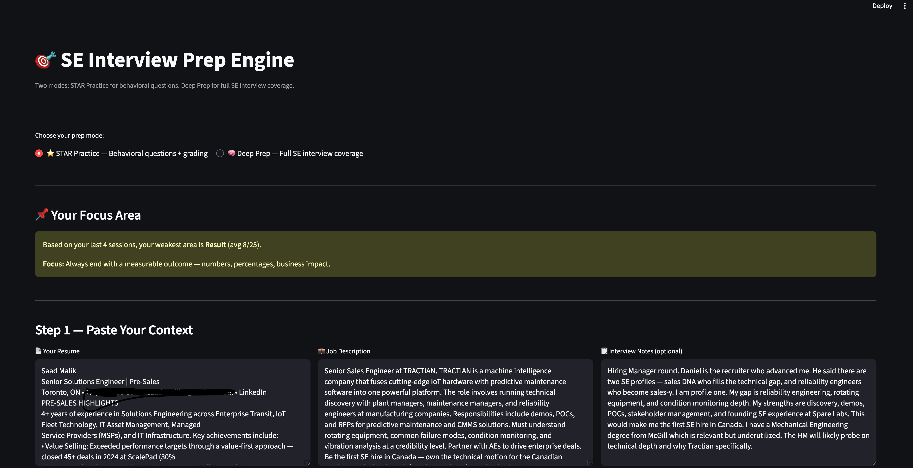

# 🎯 SE Interview Prep Engine

An open source AI powered interview prep tool for Sales Engineers. Built with Python, Streamlit, and the Anthropic Claude API.

## Screenshots




Paste your resume, the job description, and any notes about the interviewer. Get tailored interview questions across 6 categories — Behavioral, Domain Knowledge, Discovery, Objection Handling, Technical Translation, and Executive. Each question comes with a "why" explanation so you know exactly what the interviewer is testing.

---

## Why I Built This

After getting laid off, I spent weeks prepping for SE interviews. Every prep session felt the same — generic questions from Google, no idea what THIS specific interviewer would ask, no way to know if my answers were actually getting better.

So I built this. It's free, open source, and built for SEs by an SE.

If it helps you land an interview — that's the point.

---

## Two Modes

**⭐ STAR Practice** — Generates 8 behavioral questions tailored to your background. Pick one, answer it, get graded out of 100 using the STAR framework with a stronger rewrite and follow up questions. Tracks your progress over time and identifies your weakest STAR category.

**🧠 Deep Prep** — Generates questions across 6 categories with "why" explanations:
- Behavioral / STAR
- Domain Knowledge
- Discovery Questions
- Objection Handling
- Technical Translation
- Executive / Business Impact

Toggle which categories you want. Set how many questions per type (3-10). Download as a text file for offline review.

---

## Setup

### Requirements
- Python 3.9 or higher
- An Anthropic API key (get one at console.anthropic.com)

### Installation

Clone the repository:
```bash
git clone https://github.com/saadmalik2-ui/se-interview-prep-engine.git
cd se-interview-prep-engine
```

Create a virtual environment:
```bash
python3 -m venv venv
source venv/bin/activate
```

Install dependencies:
```bash
pip install -r requirements.txt
```

Set up your API key — either:

**Option 1 — Environment file (recommended)**

Create a `.env` file in the project folder:
```
ANTHROPIC_API_KEY=sk-ant-your-key-here
```

**Option 2 — Paste in browser**

Skip the `.env` file. When you run the app a password input will appear asking for your key.

### Run It
```bash
streamlit run app.py
```

The app opens at http://localhost:8501

---

## Privacy

- Your resume and answers are sent to Anthropic's API for processing
- Nothing is stored anywhere except a local SQLite database (`prep_history.db`) on your computer
- The database only stores your scores — not your resume, answers, or any personal data
- Clear your history anytime with the Clear History button

---

## Customize It For Your Role

This app is specific to Sales Engineering. If you're in a different role — PM, Marketing, Engineering — fork it and modify the prompts in `app.py` for your domain.

The pattern is the same: context in, structured output out. Only the question categories change.

---

## Built With

- Streamlit — UI framework
- Anthropic Claude API — AI model
- Python — language
- SQLite — local database

---

## License

MIT License — use it, modify it, share it freely.

---

## Feedback

Built this in an afternoon to solve a real problem. If it helps you — let me know. If you want to make it better — open a pull request.
